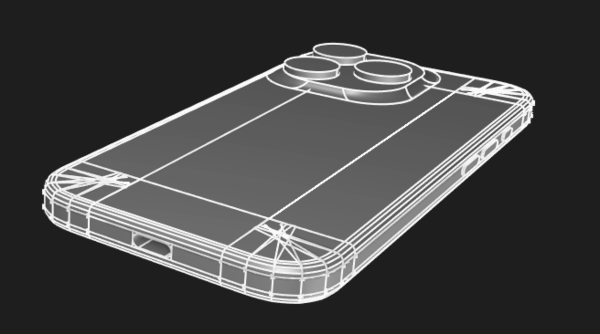

# iPhone case modeling

I wanted an excuse to learn KCL better, I like the idea of reproducable 3D modeling, and have wanted to design an 3D-printable iPhone mount for my car. Before building the mount, I wanted to practice modeling the iPhone itself.

This repository builds a 3D model of an iPhone 16 Pro using [Zoo.dev](https://zoo.dev/)'s [Modeling app](https://zoo.dev/modeling-app) in [KCL](https://zoo.dev/docs/kcl).

## Model Development

- [x] Interpoalte additional corner curve points for Bezier curves.
			(2 additional curve control points to create smooth bezier curves)
- [x] compose main body shape with corners and extrude
- [x] Interpoalte additional edge curve points for Bezier curves.
			(2 additional curve control points to create smooth bezier curves)
- [x] Sweep edge curves along corner along each corner's 6 bezier curve segments. (And duplicate/rotate for corners on top and bottom)
- [x] Extrude edge curve along sides/top/bottom (and back 4 edges)
- [x] Create center body/back rectangle (width - 2 * corner curve radius) x (length - 2 * corner curve radius) and extrude
- [ ] Create camera bumpout
- [ ] Create power/volume/action buttons
- [ ] Reverse extrude USB-C port
- [ ] Reverse extrude speaker holes

**Code Cleanup**
- [ ] Fillet edge and corner curves?
- [ ] use `rotate()` instead of all the manual rotation/function passing
- [ ] Figure out how to remove sweep paths for corner/edge volumes after use

## License

Apache 2.0
